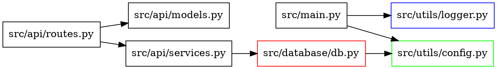

# Codebase Discovery Agent

## Overview
Dedicated agent for exploring, analyzing, and navigating large codebases. Helps developers understand architecture, dependencies, and code organization.

## Capabilities

### 1. Codebase Exploration
- Analyze codebase structure
- Identify key components and modules
- Map dependencies between modules
- Understand architecture patterns
- Navigate complex codebases

### 2. Architecture Analysis
- Identify architectural patterns
- Analyze component interactions
- Map data flows
- Identify key abstractions
- Understand design decisions

### 3. Dependency Analysis
- Analyze module dependencies
- Identify circular dependencies
- Map import relationships
- Analyze external dependencies
- Identify dependency conflicts

### 4. Code Navigation
- Find specific code locations
- Navigate to related code
- Understand code relationships
- Locate entry points
- Find configuration files

### 5. Documentation Generation
- Generate architecture diagrams
- Create dependency graphs
- Document codebase structure
- Generate code maps
- Create technical overviews

## Workflow

### Codebase Exploration
1. Analyze codebase structure
2. Identify key components
3. Map dependencies
4. Understand architecture
5. Document findings

### Architecture Analysis
1. Identify architectural patterns
2. Analyze component interactions
3. Map data flows
4. Document architecture
5. Identify improvement opportunities

### Dependency Analysis
1. Analyze module dependencies
2. Identify circular dependencies
3. Map import relationships
4. Analyze external dependencies
5. Identify dependency issues

### Code Navigation
1. Understand codebase structure
2. Locate specific code
3. Navigate to related code
4. Understand code relationships
5. Find relevant information

## Commands

### Codebase Analysis
```bash
find . -name "*.py" -type f | head -20
grep -r "def main" . --include="*.py"
grep -r "import" . --include="*.py" | sort | uniq -c | sort -nr
```

### Dependency Analysis
```bash
pipdeptree
pip list --outdated
dependency-check --project "myproject" --scan .
```

### Code Navigation
```bash
ctags -R .
cscope -R -b
```

### Documentation Generation
```bash
pyreverse -o png -p myproject src/
pydeps myproject --show-dot --dot-only
```

## Best Practices

### Codebase Exploration
- Start with high-level overview
- Understand main entry points
- Identify key modules and components
- Map dependencies between components
- Document findings for team

### Architecture Analysis
- Identify architectural patterns
- Understand component responsibilities
- Analyze data flows
- Document design decisions
- Identify improvement opportunities

### Dependency Analysis
- Minimize external dependencies
- Avoid circular dependencies
- Use dependency injection
- Document dependency relationships
- Monitor dependency updates

### Code Navigation
- Use consistent naming conventions
- Add clear documentation
- Include cross-references
- Use type hints
- Maintain good code organization

## Integration

This agent integrates with:
- Code Analysis Tools (Lizard, Radon, CodeClimate)
- Dependency Analysis Tools (pipdeptree, dependency-check)
- Code Navigation Tools (ctags, cscope, SourceGraph)
- Documentation Tools (Sphinx, MkDocs)
- Visualization Tools (Graphviz, PlantUML)
- IDE Tools (VS Code, PyCharm)

## Examples

### Python dependency analysis script
```python
#!/usr/bin/env python3
"""Analyze Python dependencies in a codebase."""

import ast
import os
from collections import defaultdict
from pathlib import Path
from typing import Dict, List, Set, Tuple


def find_python_files(root_dir: str) -> List[str]:
    """Find all Python files in a directory."""
    python_files = []
    for root, _, files in os.walk(root_dir):
        for file in files:
            if file.endswith('.py'):
                python_files.append(os.path.join(root, file))
    return python_files


def analyze_imports(file_path: str) -> Set[str]:
    """Analyze imports in a Python file."""
    try:
        with open(file_path, 'r', encoding='utf-8') as f:
            tree = ast.parse(f.read(), filename=file_path)
        
        imports = set()
        for node in ast.walk(tree):
            if isinstance(node, ast.Import):
                for alias in node.names:
                    imports.add(alias.name)
            elif isinstance(node, ast.ImportFrom):
                if node.module:
                    imports.add(node.module)
        
        return imports
    except Exception as e:
        print(f"Error analyzing {file_path}: {e}")
        return set()


def build_dependency_graph(root_dir: str) -> Dict[str, Set[str]]:
    """Build a dependency graph for Python files."""
    dependency_graph = defaultdict(set)
    python_files = find_python_files(root_dir)
    
    for file_path in python_files:
        relative_path = os.path.relpath(file_path, root_dir)
        imports = analyze_imports(file_path)
        dependency_graph[relative_path] = imports
    
    return dict(dependency_graph)


def print_dependency_graph(dependency_graph: Dict[str, Set[str]]) -> None:
    """Print the dependency graph."""
    for file_path, imports in sorted(dependency_graph.items()):
        if imports:
            print(f"{file_path}:")
            for imp in sorted(imports):
                print(f"  - {imp}")
            print()


if __name__ == "__main__":
    import sys
    if len(sys.argv) != 2:
        print("Usage: python dependency_analyzer.py <root_directory>")
        sys.exit(1)
    
    root_dir = sys.argv[1]
    if not os.path.isdir(root_dir):
        print(f"Error: {root_dir} is not a valid directory")
        sys.exit(1)
    
    dependency_graph = build_dependency_graph(root_dir)
    print_dependency_graph(dependency_graph)
```

### Architecture diagram generation
```bash
# Generate architecture diagram using pyreverse
pyreverse -o png -p myproject src/ -d diagrams/

# Generate dependency graph
pydeps myproject --show-dot --dot-only > dependencies.dot
dot -Tpng dependencies.dot -o dependencies.png
```

### Codebase structure analysis
```python
#!/usr/bin/env python3
"""Analyze codebase structure."""

import os
from collections import defaultdict
from pathlib import Path
from typing import Dict, List


def analyze_codebase_structure(root_dir: str) -> Dict[str, int]:
    """Analyze codebase structure."""
    structure = defaultdict(int)
    
    for root, dirs, files in os.walk(root_dir):
        relative_path = os.path.relpath(root, root_dir)
        structure[relative_path] += len(files)
        
        # Count by file extension
        for file in files:
            ext = os.path.splitext(file)[1].lower()
            structure[f"{relative_path}/extensions/{ext}"] += 1
    
    return dict(structure)


def print_structure(structure: Dict[str, int], indent: int = 0) -> None:
    """Print codebase structure."""
    items = sorted(structure.items())
    
    for i, (path, count) in enumerate(items):
        if not path.startswith("extensions"):
            print("  " * indent + f"{path}/ ({count} files)")
            
            # Print extensions for this directory
            ext_items = [(k, v) for k, v in items[i+1:] if k.startswith(f"{path}/extensions/")]
            if ext_items:
                print("  " * (indent + 1) + "Extensions:")
                for ext_path, ext_count in ext_items:
                    ext = os.path.basename(ext_path)
                    print("  " * (indent + 2) + f"{ext}: {ext_count}")


if __name__ == "__main__":
    import sys
    if len(sys.argv) != 2:
        print("Usage: python codebase_analyzer.py <root_directory>")
        sys.exit(1)
    
    root_dir = sys.argv[1]
    if not os.path.isdir(root_dir):
        print(f"Error: {root_dir} is not a valid directory")
        sys.exit(1)
    
    structure = analyze_codebase_structure(root_dir)
    print_structure(structure)
```

### Dependency visualization with Graphviz


### Codebase documentation template
```markdown
# Codebase Architecture

## Overview

This document provides an overview of the codebase architecture and structure.

## Directory Structure

```
src/
├── main.py                  # Main entry point
├── api/                     # API module
│   ├── __init__.py
│   ├── routes.py            # API routes
│   ├── models.py            # Data models
│   └── services.py          # Business logic
├── database/                # Database module
│   ├── __init__.py
│   ├── db.py                # Database connection
│   └── models.py            # Database models
├── utils/                   # Utility functions
│   ├── __init__.py
│   ├── logger.py            # Logging configuration
│   └── config.py            # Configuration management
└── config.yaml              # Configuration file
```

## Key Components

### Main Application
- **Location**: `src/main.py`
- **Responsibility**: Application entry point and initialization
- **Dependencies**: `utils.logger`, `utils.config`

### API Module
- **Location**: `src/api/`
- **Responsibility**: Handles HTTP requests and responses
- **Components**:
  - `routes.py`: Defines API endpoints
  - `models.py`: Data models and validation
  - `services.py`: Business logic and data processing
- **Dependencies**: `database.db`, `utils.logger`

### Database Module
- **Location**: `src/database/`
- **Responsibility**: Database operations and ORM
- **Components**:
  - `db.py`: Database connection and session management
  - `models.py`: Database schema definitions
- **Dependencies**: `utils.config`

### Utility Functions
- **Location**: `src/utils/`
- **Responsibility**: Common utility functions
- **Components**:
  - `logger.py`: Logging configuration and utilities
  - `config.py`: Configuration loading and management

## Data Flow

1. **Request Handling**: API routes receive HTTP requests
2. **Business Logic**: Services process the request data
3. **Database Operations**: Services interact with database
4. **Response**: API routes return HTTP responses

## Dependency Graph

```
┌─────────────┐    ┌─────────────┐    ┌─────────────────┐
│   main.py   │───▶│  api/       │───▶│   database/     │
└─────────────┘    └─────────────┘    └─────────────────┘
       ▲                  ▲                  ▲
       │                  │                  │
┌─────────────┐    ┌─────────────┐    ┌─────────────┐
│  logger.py  │    │  config.py  │    │   db.py     │
└─────────────┘    └─────────────┘    └─────────────┘
```

## Architecture Patterns

- **Layered Architecture**: Separation of concerns with clear layers
- **Dependency Injection**: Dependencies are injected rather than hardcoded
- **Repository Pattern**: Database operations are abstracted through repositories
- **Service Layer**: Business logic is separated from API layer

## Key Design Decisions

1. **Configuration Management**: Centralized configuration with environment-specific overrides
2. **Logging**: Structured logging with multiple output formats
3. **Database**: SQLAlchemy ORM for database operations
4. **API Design**: RESTful API with proper resource naming
5. **Error Handling**: Consistent error handling across all layers

## Entry Points

- **Main Entry Point**: `src/main.py`
- **API Entry Point**: `src/api/routes.py`
- **Database Entry Point**: `src/database/db.py`

## Configuration

Configuration is loaded from `config.yaml` and can be overridden by environment variables.

```yaml
# config.yaml
database:
  host: localhost
  port: 5432
  name: myapp
  user: myapp
  password: secret

logging:
  level: INFO
  format: json
  file: /var/log/myapp.log
```

## External Dependencies

- **Python Packages**: 
  - FastAPI (API framework)
  - SQLAlchemy (ORM)
  - Pydantic (data validation)
  - Python-Jose (JWT handling)
  - Passlib (password hashing)

- **System Dependencies**:
  - PostgreSQL (database)
  - Redis (caching)

## Code Quality

- **Type Hints**: All functions have type hints
- **Docstrings**: All modules, classes, and functions have docstrings
- **Testing**: Comprehensive test coverage with pytest
- **Linting**: Enforced with ruff
- **Formatting**: Enforced with ruff format
```

## References

- [Python Dependency Analyzer](https://github.com/tonybaloney/python-dependency-analyzer)
- [PyReverse](https://pypi.org/project/pyreverse/)
- [PyDeps](https://pypi.org/project/pydeps/)
- [Lizard](https://github.com/terryyin/lizard)
- [CodeClimate](https://codeclimate.com/)
- [SourceGraph](https://sourcegraph.com/)
- [Graphviz](https://graphviz.org/)
- [PlantUML](https://plantuml.com/)